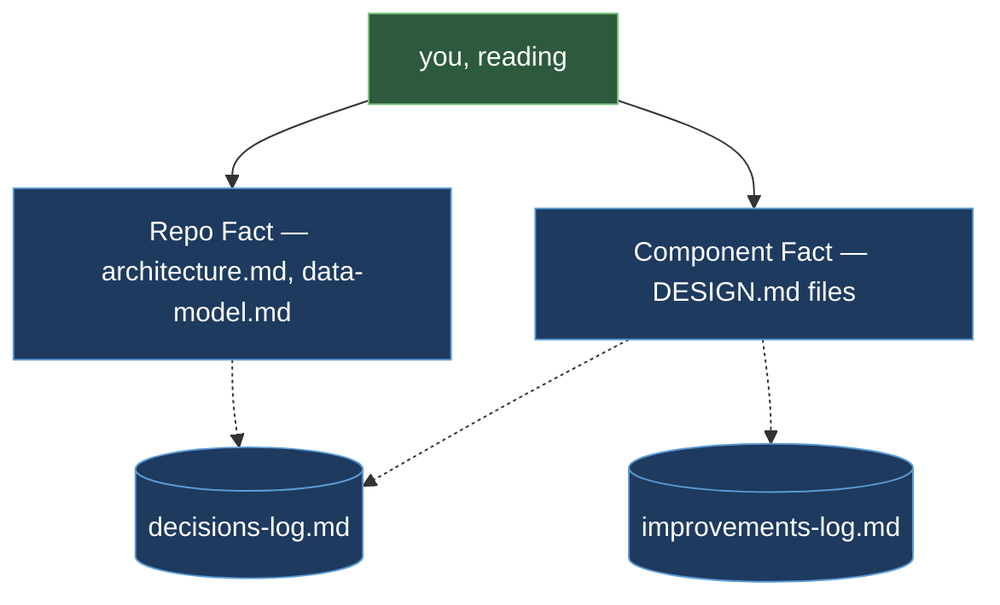

<!-- This folder is a docs-only skeleton of a fictional repo practicing DTDD. "Orderflow" is -->
<!-- invented — a web shop checkout with no code behind it. What's real is the documentation -->
<!-- structure; code files (src/, tests/, etc.) are omitted on purpose so the discipline is what shows. -->

# Orderflow

Orderflow is a web shop checkout. A browser storefront (`apps/web`) places an order; an
orders API (`services/orders`) validates the checkout, computes the total, and finalizes the
order; a payments worker (`services/payments`) charges the customer asynchronously through
the payment provider; a fulfillment service (`services/fulfillment`) moves paid orders onward
to a shipment. One shared relational database holds `orders`, `charges`, and `shipments` —
each table with exactly one writer — and one queue system carries `charge-requested` and
`charge-settled` between the services.

## The Mental Map

Every question a newcomer asks about this repo has one home. The home is chosen by tier, not
by convenience — each tier holds a different *kind* of truth.

| Question | Document | Why it lives at that tier |
|---|---|---|
| What does one component do, and what must stay true inside it? | that component's own `DESIGN.md` (e.g. `services/orders/DESIGN.md`) | Component Fact — one document per component, owned by whoever is changing it |
| How do the pieces connect, and where does the database live? | `docs/architecture/architecture.md` + `docs/architecture/data-model.md` | Repo Fact — the cross-component truth no single component's doc can hold |
| Why is it built this way? | `docs/decisions/decisions-log.md` | the permanent narrative — decisions and rejected alternatives, in order, never deleted |
| What is known-imperfect right now? | `docs/improvements/improvements-log.md` | a transient tracker — entries are deleted the moment they're resolved |
| How do I prove the critical behavior? | `docs/runbooks/` | evidence for the Fact — an executable scenario, not a claim |
| What rules govern agents working here? | `CLAUDE.md` | the rules layer — reading priority, document ownership, gates |



The two Fact tiers are solid arrows: a reader goes straight to them for present-state truth.
The logs sit beside the tiers, reached only when the present-state doc raises a "why" or an
"open problem" the reader wants more on — they are never the first stop.

## The Folder Map

```
examples/orderflow/
├── README.md                          ← this file — the tour
├── CLAUDE.md                          ← rules for agents working in this repo
├── docs/
│   ├── architecture/
│   │   ├── architecture.md            ← Repo Fact: the four components, how they connect
│   │   └── data-model.md              ← Repo Fact: orders / charges / shipments, one writer each
│   ├── decisions/
│   │   └── decisions-log.md           ← permanent narrative — why, in order, never deleted
│   ├── improvements/
│   │   └── improvements-log.md        ← transient — known-imperfect, open entries only
│   ├── runbooks/
│   │   └── duplicate-charge.md        ← evidence: a redelivered charge never double-charges
│   └── templates/
│       └── DESIGN.template.md         ← the fixed 12-section shape every DESIGN.md follows
├── services/
│   ├── orders/
│   │   └── DESIGN.md                  ← Component Fact: checkout, order total, order status
│   ├── payments/
│   │   └── DESIGN.md                  ← Component Fact: charging, retries, idempotency
│   └── fulfillment/
│       └── DESIGN.md                  ← Component Fact: shipment, order-status transitions
└── apps/
    └── web/
        └── DESIGN.md                  ← Component Fact: the storefront, talks only to orders' API
```

In a real repo, each component folder under `services/` and `apps/` also holds its own `src/`,
`tests/`, and build config — omitted here because this folder teaches the documentation
structure, not a runnable checkout.

## Reading Order — You Just Joined This Team

1. **`CLAUDE.md`** — the rules you work under before you touch anything.
2. **`docs/architecture/architecture.md`** — the shape of the whole system, so you know where
   your component sits.
3. **`docs/architecture/data-model.md`** — the shared tables, and who is allowed to write each
   one.
4. **The `DESIGN.md` of the component you're about to touch** — its contract, its mechanism,
   its invariants.
5. **`docs/decisions/decisions-log.md`** — read an entry only when a design choice puzzles you;
   it explains what was rejected and why, so you don't re-propose it.
6. **`docs/improvements/improvements-log.md`** — check before starting work in an area; a known
   gap there may already describe the exact thing you were about to report as a bug.

## One Live Seam, Walked

Take `charge-requested`, the event that moves an order from "placed" to "being charged." Three
places carry this one contract:

- **The producer declares it.** `services/orders/DESIGN.md`, under *What This Does* and
  *Boundaries*, states that the orders service publishes `charge-requested` to the charge queue
  once an order's total is finalized, and gives the exact message shape.
- **The consumer declares it.** `services/payments/DESIGN.md`, under *What This Does*, gives
  the same message shape from the receiving side; under *Boundaries*, its "Upstream producer"
  entry states that it trusts the message's amount and currency as final and does not
  recompute the order total.
- **The why lives in the log.** `docs/decisions/decisions-log.md` entry 1 records that charging
  is asynchronous — a queue between orders and payments — because checkout must return to the
  shopper immediately, and rejects charging synchronously inside the checkout request.

This is exactly what an orchestrator's seam detection reads: two `DESIGN.md` files agreeing on
one contract from opposite sides, with the decision log holding the why neither document needs
to repeat.

## Where To Go Next

For the methodology this folder demonstrates, read [../../guide/methodology.md](../../guide/methodology.md)
(the Fact model and the two tiers above) and [../../guide/design-docs.md](../../guide/design-docs.md)
(the 12-section `DESIGN.md` template every component file here follows).
