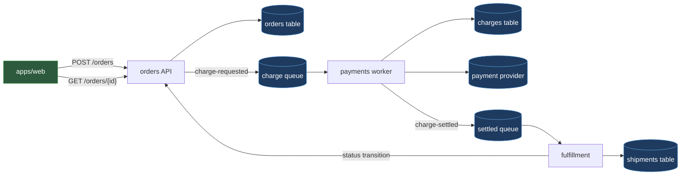

# Orderflow — Architecture

Orderflow is a web shop checkout system. A browser storefront places an order; an HTTP API
finalizes it and hands charging off to a background worker so the shopper never waits on a
payment provider; a fulfillment service picks up the settled charge and moves the order toward
a shipment. Four components share one relational database and one queue system; each database
table has exactly one writer, and every other component reaches that table's owner through an
event or an API call rather than a direct read or write. See
[`data-model.md`](./data-model.md) for the schema this rule protects.

## Components

- **`apps/web`** — browser storefront; talks only to `services/orders`' HTTP API
  (`POST /orders`, `GET /orders/{id}`), with no queue or database access of its own. See
  [`../../apps/web/DESIGN.md`](../../apps/web/DESIGN.md).
- **`services/orders`** — validates checkout input, computes the order total, owns the
  `orders` table, publishes `charge-requested`, and exposes the internal status-transition
  endpoint `POST /internal/orders/{id}/status` that `services/fulfillment` calls. See
  [`../../services/orders/DESIGN.md`](../../services/orders/DESIGN.md).
- **`services/payments`** — charges the customer through the payment provider, owns the
  `charges` table, and publishes `charge-settled`. See
  [`../../services/payments/DESIGN.md`](../../services/payments/DESIGN.md).
- **`services/fulfillment`** — consumes `charge-settled`, requests the order's next status
  through `services/orders`' internal endpoint, and owns the `shipments` table; it never
  writes `orders` directly and never queries `charges`. See
  [`../../services/fulfillment/DESIGN.md`](../../services/fulfillment/DESIGN.md).

## How It Works



`services/orders` writes the `orders` row before it publishes `charge-requested` — the order
must exist as `placed` before anything downstream can act on it.

## Seams

Two events are the only channels between components; each is a frozen contract, not an
implementation detail either side can change alone.

**`charge-requested`** — producer `services/orders`, consumer `services/payments`:

```json
{ "orderId": "ord_8f3a1c", "customerId": "cus_2b91", "amountMinorUnits": 4999,
  "currency": "USD", "paymentMethodToken": "pm_tok_9e21" }
```

`services/orders` publishes this once the order total is finalized and trusts it as final on
the other side — see [`../../services/payments/DESIGN.md`](../../services/payments/DESIGN.md)
for how the worker treats these fields as authoritative.

**`charge-settled`** — producer `services/payments`, consumer `services/fulfillment`:

```json
{ "orderId": "...", "status": "succeeded" | "declined", "providerChargeId": "..." }
```

`services/fulfillment` acts on `status` alone; it does not query `services/payments`'
`charges` table to confirm the event. See
[`../../services/fulfillment/DESIGN.md`](../../services/fulfillment/DESIGN.md).

## Order Status Lifecycle

`services/orders` owns the `status` column and its enum; every transition after `placed` is
requested by `services/fulfillment` through the internal endpoint, never written by
`services/fulfillment` itself:

- `placed` → `paid` — requested by `services/fulfillment` when `charge-settled` carries
  `succeeded`.
- `placed` → `cancelled` — requested by `services/fulfillment` when `charge-settled` carries
  `declined`.
- `paid` → `shipped` — requested by `services/fulfillment` once its own shipment record moves
  to `dispatched`.

## Cross-Cutting Rules

1. **One writer per table.** Rule: each of `orders`, `charges`, and `shipments` has exactly one
   component that writes it. Why: a table with two writers has no single component whose
   `DESIGN.md` can promise its invariants. See [`data-model.md`](./data-model.md).
2. **All cross-component communication goes through an event or the owning component's API —
   never a direct table read or write.** Rule: `services/fulfillment` reads no table it doesn't
   own; it learns charge outcomes from `charge-settled` and changes order status through
   `services/orders`' internal endpoint. Why: a component reaching past another's API into its
   schema couples the two at the database layer, so a column rename in one silently breaks the
   other with no contract to catch it.
3. **Checkout has a latency budget: `POST /orders` returns before the charge settles.** Rule:
   `services/orders` writes the `orders` row and publishes `charge-requested` inside the
   request, then responds — it never waits on `services/payments` or the provider. Why: a
   card-network round trip can run seconds or longer under provider degradation; holding the
   checkout connection open for it turns a slow or failing provider into a slow or failing
   storefront.
