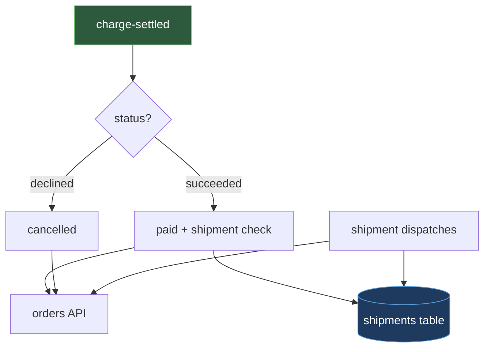

# services/fulfillment — Design & Decision Log

`services/fulfillment` is a queue-consuming service that advances an order from paid to shipped
once its charge settles, and owns the shipment record that tracks that progress. Start reading
at `src/consumer.ts` (poll loop and dispatch), then `src/settlement.ts` (idempotency check,
transition, shipment creation), then `src/orders-client.ts` (the orders internal-endpoint HTTP
client) — read [`../orders/DESIGN.md`](../orders/DESIGN.md) first for that endpoint's contract.

## Why This Exists

An order that has been placed and charged still needs someone to carry it past "paid": mark it
paid, prepare a shipment, and later mark it shipped once that shipment leaves the warehouse.
Nothing upstream does this — orders' contract ends at serving order status, and payments' ends
at publishing the charge outcome; `services/fulfillment` turns a settled charge into that progress.

## What This Does

The worker consumes `charge-settled` messages, shaped as
`{ "orderId": "ord_8f3a1c", "status": "succeeded", "providerChargeId": "..." }` where `status`
is `succeeded` or `declined`. For each message it calls the orders internal endpoint,
`POST /internal/orders/{id}/status`, and — on `succeeded` only — writes one row into its own
`shipments` table. It exposes no HTTP endpoint of its own.

| Field | Type | Meaning |
|---|---|---|
| `shipmentId` | string, primary key | This shipment's own identifier |
| `orderId` | string, foreign key | The order this shipment fulfills |
| `carrier` | string | The carrier assigned to the shipment |
| `status` | enum | `preparing` \| `dispatched` |
| `createdAt` | timestamp | When the shipment row was created |

## How It Works

1. The worker polls the settled queue and receives one `charge-settled` message.
2. On `succeeded`, it transitions the order from `placed` to `paid`, then checks its own
   `shipments` table for a row with that `orderId` — an existing row means it acknowledges
   without writing again (this is what makes redelivery safe); no row means it inserts one in
   `preparing` status.
3. On `declined`, it transitions the order from `placed` to `cancelled` and creates no shipment.
4. Independently of the settled queue, when a shipment dispatches, the worker updates that
   shipment's row to `dispatched` and transitions the order from `paid` to `shipped`.

## Boundaries

- **Upstream producer:** payments publishes `charge-settled`; the worker trusts `status` as
  final and never reads `charges` to check it.
- **Downstream dependency:** orders owns the `orders` table and its status-transition endpoint;
  the worker does not know how orders stores or validates the transition.
- **Own data:** the `shipments` table is written only by this worker. The consumer loop must NOT
  know the orders endpoint's request shape, and the orders client must NOT know which event
  triggered its call — so the client can be tested against a fake endpoint with no queue running.

## Rules & Invariants

1. **The worker never writes the `orders` table directly.** Rule: every order-status change goes
   through the orders internal endpoint. Why: one-writer-per-table only holds if every non-owner
   uses the owner's API, else fulfillment and orders could disagree who last changed the row.
2. **Shipment creation is idempotent on `orderId`.** Rule: the worker skips the insert if a
   `shipments` row for that `orderId` already exists. Why: the settled queue delivers at least
   once, so a redelivered `charge-settled` must not create a second shipment.
3. **The worker never queries the `charges` table.** Rule: its only knowledge of a charge outcome
   is the `charge-settled` event itself. Why: a direct query would couple it to a schema
   `payments` owns, so a schema change there could silently break fulfillment.

## Key Design Decisions

1. **The worker learns payment outcomes by consuming `charge-settled` events, never by reading
   `charges`.** This decouples fulfillment from a schema it doesn't own. Rejected: polling
   `charges` on an interval, which adds latency and ties fulfillment to payments' schema.
2. **Order-state changes go through the orders internal endpoint, never a direct table write,**
   even though both share one database. Rejected: writing `status` directly, which makes write
   authority ambiguous once two components can change the same row.

## Deliberately Left Out

- **The dispatch trigger mechanism** — carrier webhook, warehouse callback, manual update — is
  not specified; the contract starts at dispatch confirmation, not at how it arrives.
- **Carrier selection and shipping-rate logic** belong to whatever assigns a carrier, not to
  this worker, which only stores whichever `carrier` it is given.

## Configuration

| Variable | Purpose | Default |
|---|---|---|
| `ORDERS_INTERNAL_URL` | Base URL of the orders service's internal API | none — required at startup |
| `SETTLED_QUEUE_URL` | Queue the worker polls for `charge-settled` messages | none — required at startup |

## Open Questions

None — no open questions.

## Next Steps

None — no near-term work planned.

## Related Documents

- [`../../docs/architecture/architecture.md`](../../docs/architecture/architecture.md) — the system-wide architecture.
- [`../../docs/architecture/data-model.md`](../../docs/architecture/data-model.md) — the shared schema, including `shipments`.
- [`../payments/DESIGN.md`](../payments/DESIGN.md) — publishes the `charge-settled` event this worker consumes.
- [`../orders/DESIGN.md`](../orders/DESIGN.md) — owns the internal status-transition endpoint this worker calls.
