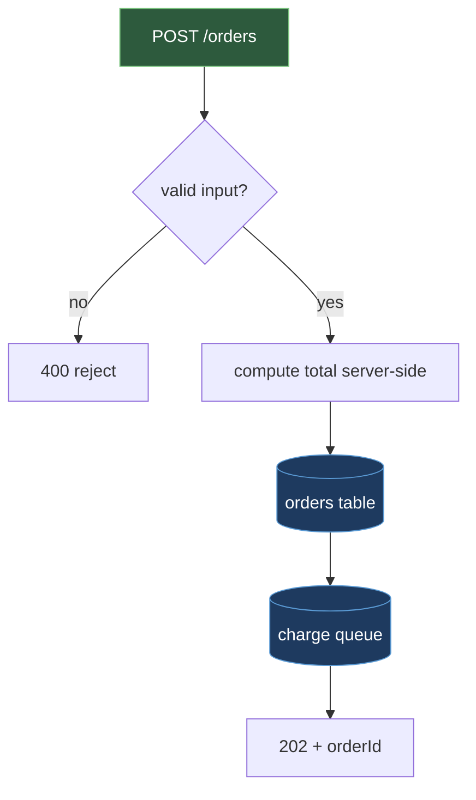

# services/orders — Design & Decision Log

`services/orders` is the HTTP API that turns a shopper's finalized cart into a durable order
and starts the charge process. Start reading at `src/routes.ts` (endpoint definitions and
request wiring), then `src/checkout.ts` (validation, total computation, order persistence),
then `src/publisher.ts` (the `charge-requested` publish call).

## Why This Exists

A shopper's cart is just numbers in a browser until something turns it into a commitment the
rest of the system can act on. That something has to do two things in the same breath: finalize
a real, trustworthy order the shopper can be charged for, and hand off to charging without
making the shopper sit through however long a card network takes to respond. `services/orders`
is the one place that does both — it is the only writer of the `orders` table, and the only
producer of `charge-requested`, so every downstream component has exactly one place to look for
"does this order exist, and what does it cost."

## What This Does

| Method & Path | Caller | Purpose |
|---|---|---|
| `POST /orders` | `apps/web` | Place an order from a checkout submission |
| `GET /orders/{id}` | `apps/web` | Read current order status |
| `POST /internal/orders/{id}/status` | `services/fulfillment` | Request a status transition |

**`POST /orders`** validates the request body at the boundary — item shape and types, currency
against a fixed whitelist, and amount bounds — before any of it reaches checkout logic. It then
computes the order total itself from the priced items, ignoring any total field on the request.
It writes one row to `orders` with status `placed`, then publishes `charge-requested` to the
charge queue, shaped exactly:

```json
{
  "orderId": "ord_8f3a1c",
  "customerId": "cus_2b91",
  "amountMinorUnits": 4999,
  "currency": "USD",
  "paymentMethodToken": "pm_tok_9e21"
}
```

It responds `202 Accepted` with the new `orderId` — the charge itself has not happened yet.

**`GET /orders/{id}`** returns the current row from `orders` (status, amount, currency,
timestamps) for `apps/web` to render and poll.

**`POST /internal/orders/{id}/status`** accepts a requested status and applies it only if the
transition is one of `placed → paid`, `placed → cancelled`, or `paid → shipped`; any other
requested transition is rejected. `orders` table fields: `orderId` (PK), `customerId`,
`amountMinorUnits`, `currency`, `status` (`placed` | `paid` | `cancelled` | `shipped`),
`createdAt`, `updatedAt`.

## How It Works



1. `routes.ts` validates the request body — types, currency whitelist, amount bounds — and
   rejects anything malformed before `checkout.ts` runs.
2. `checkout.ts` recomputes the total from the priced line items and inserts one `orders` row
   with status `placed`.
3. Once that insert commits, `publisher.ts` publishes `charge-requested` onto the charge queue,
   carrying the pinned shape above.
4. The handler responds `202 Accepted` with `orderId`; the shopper's request is done.
5. Later, `services/fulfillment` calls `POST /internal/orders/{id}/status` as the charge and
   shipment settle, moving the row through `paid` and `shipped` (or `cancelled`).

## Boundaries

- **Upstream: `apps/web`.** The only caller of the public endpoints. `services/orders` trusts
  nothing it sends about pricing — every amount is recomputed server-side.
- **Downstream: `services/payments`, via the charge queue.** `services/orders` is the producer
  of `charge-requested`; the message shape is the pinned contract between the two services, and
  changing it here is a cross-service change, not a local one. `services/orders` never calls
  `services/payments` directly and never reads the `charges` table.
- **Downstream: `services/fulfillment`, via the internal endpoint.** `services/fulfillment` is
  the only caller of `POST /internal/orders/{id}/status`. `services/orders` never learns a
  charge outcome directly from `services/payments` — it learns one only as a status-transition
  request from `services/fulfillment`, after `services/payments` has published `charge-settled`
  and `services/fulfillment` has consumed it.

## Rules & Invariants

1. **The server computes the total.** `checkout.ts` prices the order from the submitted line
   items and discards any total field present on the request body before writing `orders` or
   publishing `charge-requested`. Rule: no client-supplied amount ever reaches a row or an
   event. Why: a client that could set its own total could check out for less than the real
   price — the server is the only party with a reason to get this number right.
2. **`charge-requested` is published only after the `orders` row commits.** The publish call in
   `publisher.ts` runs after the insert into `orders` returns successfully, never before or in
   parallel. Rule: an event referencing an order that doesn't exist yet must be impossible. Why:
   `services/payments` and `services/fulfillment` both key their own tables on `orderId` — an
   event that arrives ahead of the row it describes would leave nothing for those lookups to
   find.
3. **Status transitions are whitelisted pairs.** `POST /internal/orders/{id}/status` checks the
   requested `(currentStatus, newStatus)` pair against exactly `placed → paid`,
   `placed → cancelled`, `paid → shipped` and rejects anything else. Rule: only those three
   transitions can ever be applied to an `orders` row. Why: a bug in `services/fulfillment` can
   send an unexpected request, but it cannot make that request invent a state the lifecycle
   doesn't define.

## Key Design Decisions

1. **`POST /orders` returns `202 Accepted` before the charge happens, rather than waiting for
   `services/payments` to settle it.** Checkout latency is bounded by a database write and a
   queue publish, not by a card network round trip. The rejected alternative — charging
   synchronously inside `POST /orders` — was dropped because it holds the shopper's connection
   open for as long as the provider takes to respond, and turns a provider outage into a
   checkout outage.
2. **`services/fulfillment` requests status changes through `POST /internal/orders/{id}/status`
   rather than writing the `orders` table itself.** This keeps `services/orders` as the single
   writer of its own table, per the repo's one-writer-per-table rule — every other component
   reaches a table it doesn't own only through the owning component's API or events. The
   rejected alternative — letting `services/fulfillment` write `orders` directly since it
   already knows the target status — was dropped because it would give two components write
   access to the same table, and nothing short of the whitelist check in this service would stop
   an invalid transition from landing.

## Deliberately Left Out

- **Cart persistence.** `services/orders` receives a finalized checkout submission; it does not
  store an in-progress cart across a shopping session. Reason: that state belongs to whatever
  holds the shopper's session before checkout, not to the service that finalizes an order.
- **Pricing and discount logic.** `services/orders` recomputes a total from line-item prices it
  is given; it does not decide what those prices are or apply promotions. Reason: pricing rules
  change independently of order finalization and belong to a component whose only job is
  getting the price right.

## Configuration

| Variable | Purpose | Default |
|---|---|---|
| `ORDERS_DB_URL` | Connection string for the database holding the `orders` table | none — required at startup |
| `CHARGE_QUEUE_URL` | Queue this service publishes `charge-requested` onto | none — required at startup |
| `PORT` | Port the HTTP API listens on | `3000` |
| `ALLOWED_CURRENCIES` | Comma-separated currency whitelist checked at the boundary | `USD` |

## Open Questions

None — no open questions.

## Next Steps

The checkout handler in `checkout.ts` rounds money amounts in two separate branches with
duplicated rounding logic; extracting one shared rounding helper removes the duplication (see
IMP-001 in the improvements log).

## Related Documents

- [`../../docs/architecture/architecture.md`](../../docs/architecture/architecture.md) — platform-wide architecture
- [`../../docs/architecture/data-model.md`](../../docs/architecture/data-model.md) — shared database schema, including the `orders` table
- [`../payments/DESIGN.md`](../payments/DESIGN.md) — the consumer of `charge-requested`
- [`../fulfillment/DESIGN.md`](../fulfillment/DESIGN.md) — the caller of the internal status-transition endpoint
