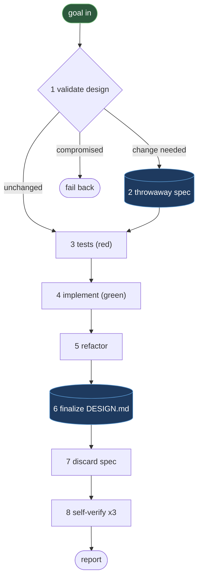

# The Loop

DTDD runs the same discipline at two tiers: **validate the design first, derive tests from it,
then write code test-first** — with the canonical design doc read at the start, to judge the
change, and written last, to reflect what landed. One tier is the **worker loop**, which changes
a single component. The other is **repo-wide orchestration**, which decomposes a change spanning
several components into per-component goals, sequences them at their shared boundaries, and holds
the gates a worker cannot. This document covers both, plus the ownership rule deciding who may
write which document.

See [design-docs.md](design-docs.md) for the present-state writing rule these steps assume,
[testing.md](testing.md) for the three-checks discipline behind step 8,
[review-gates.md](review-gates.md) for the reviewer lenses orchestration relies on,
[principal-orchestrator.md](principal-orchestrator.md) for the tier above orchestration that
turns a multi-stage goal into a sequence of runs of this loop, and
[methodology.md](methodology.md) for the ideologies this loop is built from.

---

## The worker loop

A worker owns exactly one component — say, an `email-sender` service, or a `payments` API. It
receives a technical goal ("retry throttled sends with backoff", "add a `priority` field to
outbound messages"), not an instruction sheet, and runs eight steps in order.

**1. Validate design (gate).** *Mechanism* — read the component's `DESIGN.md`: what it does,
who it talks to, what must always hold true. Judge the goal against it and land on exactly one
outcome — **unchanged** (pure implementation detail, skip to tests), **change needed** (the
design must evolve), or **compromised** (the goal breaks a standing invariant, or needs scope
the worker wasn't given — a new dependency, an architectural change, edits outside the
component). *Rule* — a compromised finding stops the worker cold: it does not improvise a
smaller goal, drop the invariant, or quietly expand its own scope; it reports a failback with a
one-line reason and a suggested alternative, and waits. *Why* — the design doc is what separates
"the agent decided this was fine" from "a documented invariant was checked"; making the failback
structural, not a mid-implementation judgment call, is what keeps one compromised component from
corrupting a shared contract at a seam (see Orchestration, below).

**2. Draft a throwaway spec.** *Mechanism* — when the design must change, write the delta, not
the whole doc, to a namespaced scratch path (e.g. `tmp/<run_id>/<component_name>/spec.md`), capturing
the invariants the tests must encode. *Rule* — never the canonical doc, never read outside this
run, deleted unconditionally in step 7. *Why* — design intent needs somewhere to live while it's
still being worked out; writing straight into `DESIGN.md` mid-change would leave it half-updated
if the run stalls or fails back, where a scratch file can be revised freely without ever exposing
a not-yet-true doc as the Fact.

**3. Tests (red).** *Mechanism* — derive test cases from the spec, the component's existing
invariants, and — at a seam — the pinned contract; each invariant and contract clause becomes at
least one test. Run them and confirm they fail for the reason the change predicts, not a typo or
a missing import. *Rule* — every test is Arrange/Act/Assert, with those three comments present in
the body. *Why* — a suite that never went red proves nothing; confirming the *right* red before
the fix is what makes the green in step 4 meaningful evidence, not a coincidence.

**4. Implement (green).** *Mechanism* — write the minimal code that makes the red tests pass;
reconcile any dependency manifest or lockfile immediately if a dependency changed, so later checks
run against the real installed state. *Rule* — minimal means minimal: no adjacent refactor, no
unrelated cleanup, no scope beyond what step 1 validated. *Why* — deferring "while I'm in here"
cleanup to step 5, where it's bounded to no behavior change, keeps the diff traceable to the
goal — a reviewer can tell what the change *is* without auditing an unrelated rewrite too.

**5. Refactor.** *Mechanism* — clean up implementation details with tests staying green
throughout. *Rule* — no behavior change, no scope creep; this is not a second chance to expand
the goal. *Why* — separating "make it work" from "make it clean" keeps the red-green evidence
from steps 3–4 intact: refactoring under a green suite is safe because the suite is the proof
nothing observable moved.

**6. Finalize the canonical design doc (write-last).** *Mechanism* — update only the affected
sections of `DESIGN.md` to describe what now exists, present tense, present state. *Rule* — write
the canonical doc once, here, against what actually landed, never twice for one change; no
changelog language ("replaced", "no longer", "previously") and no dates — that dated before/after
belongs in the decisions log, a separate document with its own lifecycle (see
[design-docs.md](design-docs.md)). *Why* — a doc that is both the plan and the record drifts the
moment the plan changes mid-run; writing it once, last, against reality is what makes it
trustworthy as the Fact the *next* worker reads at step 1.

**7. Discard the throwaway spec.** *Mechanism* — delete the scratch spec from step 2,
unconditionally. *Rule* — the canonical doc is now the only durable record; nothing else is left
around claiming to also describe the design. *Why* — a leftover scratch file is a second,
uncurated place someone might later mistake for the Fact; deleting it removes the ambiguity
instead of trusting everyone to know which file is authoritative.

**8. Self-verify — three checks.** *Mechanism* — run and separately report three distinct
checks: a **build** (the component actually compiles/emits — a typecheck is not a build), the
**tests** (unit plus self-contained integration; explicitly name any test needing live external
infrastructure that couldn't be exercised here — never silently treat it as passed), and a
**runtime smoke** (boot or invoke the specific entry point that changed, with a minimal valid
input). *Rule* — all three are reported, not just the first that passes; "builds" is not "runs."
*Why* — each check catches a failure the others cannot: a passing build can still crash on boot, a
passing test suite can still miss the one live integration nobody could run here. Naming what
wasn't exercised, rather than staying silent about it, is what keeps an unavoidable gap from
masquerading as a clean pass.

### Enforcement is asymmetric — stated honestly

This is genuine red-green-refactor test-driven development, and the tests are design-derived —
pulled from real invariants and the pinned contract, never invented for their own sake. But the
loop's two disciplines are not enforced the same way. The **Design** half is *gate-enforced*: a
separate, independent-context review checks the staged diff against the doc before a commit can
proceed, and structurally blocks the commit if the doc and the code disagree (see
[review-gates.md](review-gates.md)). The **TDD** half is *prompt-enforced* only: the worker is
instructed to write tests first and confirm red before green, but nothing mechanically captures
proof that red state actually happened. A worker that follows the loop does real test-first
development; nothing today stops a worker from writing tests after the fact and simply *claiming*
it saw red. Closing that gap — a captured red-state artifact checked before green is allowed — is
a known future hardening, not yet built. Overstating this as fully gated would be dishonest about
what's actually enforced versus merely instructed.

---

## Repo-wide orchestration

Some goals cross a boundary a single worker doesn't own — a shared type, a response shape, an API
surface more than one component depends on. Orchestration decomposes such a goal into
per-component goals, runs a worker loop for each affected component, and holds two gates a worker
cannot reach on its own.

**Seam detection — from design docs only.** *Mechanism* — for each candidate component, read only
its `DESIGN.md`: the section describing its export surface (what it produces, its public API) and
the section describing its boundaries (who consumes it, what it depends on). A seam exists when
one component's declared output is another's declared input — e.g. `email-sender` emits a
`DeliveryResult` shape that a `reporting` component consumes. *Rule* — the orchestrator never
reads a component's internal code to decide whether it needs to change; that question is answered
by dispatching the component's own worker in read-only plan mode. *Why* — reading internals to
make this call would recreate the dilution DTDD exists to avoid, one actor holding every
component's implementation in its head. Docs are the bounded context on purpose (see
[methodology.md](methodology.md)): the orchestrator reasons about *boundaries*, each worker
reasons about its own *internals*.

**Bootstrapping — when the Fact is still thin.** Seam detection is only as good as the design
docs it reads, and a repo newly adopting DTDD has few or none — the scaffolder deliberately
refuses to bulk-generate them, because a doc written without reasoning is noise wearing the
Fact's name. The honest path: early runs scope conservatively (fewer candidate components,
more human attention at the planning gate), and each component's first DTDD change creates
its `DESIGN.md` properly — the worker reasons about the component to change it, and the
design-sync reviewer creates a template-based doc for any changed component that lacks one.
The Fact thickens change by change; seam detection earns its blindfold as the docs earn
their trust. Expect the first weeks to lean on the human gates harder than the steady state
does.

**Two waves — plan (read-only), then execute.** *Mechanism* — the **plan wave** dispatches every
candidate's worker in plan mode, in parallel; it writes nothing, and each worker reports whether a
change is needed, what it would do, what existing behavior must be preserved, and what new failure
modes the change introduces — plus, at a seam, whether it can expose or consume the proposed
contract. The orchestrator folds these into a pinned contract and a plan, drops any component
reporting no change needed, and only then dispatches the **execute wave**: the same components, in
execute mode, running the full eight-step loop, seam producer before consumers (or all in parallel
against a contract pinned up front). *Rule* — nothing is written until the execute wave; a
confirmed no-op from the plan wave is never dispatched to execute. *Why* — assessing before acting
grounds the plan in what each worker actually found rather than a guess from the goal in isolation,
and guarantees no wasted loop ever runs against a component that didn't need one.

**Two human gates.** *Mechanism* — exactly two points ask a human to look, and they are not
interchangeable. The **planning gate**, before any write, presents the affected set (no-ops
marked), the pinned contract at each seam, the dispatch order, and the shared documents that will
change. The **commit gate**, after the execute wave and its fan-in checks (build, test, code
review, cross-component doc consistency), presents the full diff, every result, and any action
only a human can take. *Rule* — the planning gate need not pause every run: the orchestrator, who
holds the goal and did the decomposition, approves a routine plan itself and proceeds, escalating
only on a genuine break — a finding that contradicts a recorded decision or undermines the goal's
premise. A correctable adjustment short of that is fixed and made *visible* at the commit gate
instead. The commit gate always pauses; there is no shortcut for it. *Why* — a routine plan
doesn't need a second opinion from the actor that just built it; what needs a human is a diff
about to become permanent, with a review verdict attached. Making the commit gate the one
unconditional stop is what makes skipping the planning-gate pause, on routine runs, safe rather
than reckless.

**Failback discipline.** *Mechanism* — a worker has no channel to a human. If, in either mode, it
finds the pinned contract wrong or the goal unachievable within its own invariants and scope, it
stops and reports a failback: reason plus a suggested alternative shape, and does not improvise a
divergent one to keep moving. *Rule* — the orchestrator receives the failback, re-pins the
contract or re-scopes the goal from the suggestion, and re-dispatches the affected component —
never the worker retrying on its own judgment. *Why* — two workers on either side of a seam, each
improvising independently when the contract feels wrong, is the one way this pattern actually
breaks: they diverge silently and the interface's two halves stop matching. Routing every
disagreement back through the actor that pinned the contract is what keeps a seam from ever having
two authors.

**Model-tier discipline.** *Mechanism* — the orchestrator runs on the strongest available
reasoning tier, because decomposition — seam detection, contract pinning, judging routine versus
escalation — is the hard part and there is only one orchestrator per run; each worker runs on a
mid tier, because executing an already-decomposed, scoped goal is comparatively mechanical, and
there are many workers per run. *Rule* — neither tier delegates a canonical document write
downward: a component's `DESIGN.md` is written by its own worker, never drafted by the
orchestrator; the shared, repo-level documents are written by the orchestrator, never handed to a
worker. *Why* — this follows reasoning-actor ownership (see [methodology.md](methodology.md)):
whichever actor reasoned about a piece of the Fact is the one that writes it down — a cheaper
model writing a doc it didn't reason about is how a canonical doc quietly stops matching the
reasoning that supposedly produced it.

---

## Document Ownership

Every document in a DTDD-managed repository has exactly one owner, decided by who did the
reasoning that produced it — never by convenience or by whichever actor happened to be writing at
the time.

| Tier | Owner | Timing |
|---|---|---|
| Component code, tests, `DESIGN.md`, component-local README | Worker | `DESIGN.md` read-first at the validate-design gate (step 1); written last (step 6), once the change has landed |
| Shared docs (architecture, data model, decisions log, improvements log, runbooks), deploy config, root README | Orchestrator | At fan-in, after the execute wave — serialized, never written by parallel workers, so an append-only log is never clobbered |
| Templates, root project-instructions file, prompts, skills, agent definitions | Human (approval authority) | Never written autonomously during a run; the orchestrator or a worker may *propose* a change, but a human decides |

**Principle: document writes stay with the reasoning actor.** A component's worker is the only
actor that reasoned about that component's internals, so it alone writes its `DESIGN.md`. The
orchestrator is the only actor that reasoned across components, so it alone writes the shared
docs — once, at fan-in, after every worker has reported, never mid-run against a plan that might
still change. The third tier exists because some documents govern the methodology or the
repository itself, not any one change — no amount of in-run reasoning substitutes for a human's
ongoing approval authority over those.
